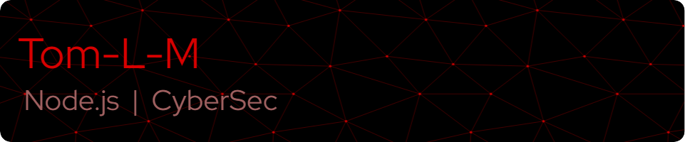

 

 

  

 

 
 
**<h3 align="center">NodeJS developer, graduate in cybersecurity and on the road to be a post-graduated software engineer. Building APIs now, but forever a fan of virtualization and emulators. Also enthusiastic about cybersecurity-designed software and low-level programming (let's talk about Z80 and ATMega assembly 😀). </h3>**

 

 

     
 
             

 

 

 

 

